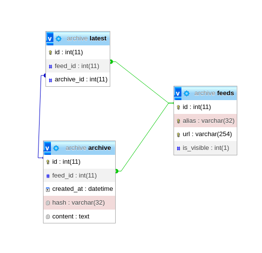

# feed-archive

## Database structure



## Install Howto dev tools

**Boost**

```shell
dnf install boost boost-devel boost-python3
```

**Mysql libs**

Download latest mysql80-community-release-el8 rpm from http://repo.mysql.com/

Install mysql80-community-release rpm:

```shell
rpm -Uvh mysql80-community-release*rpm
```

Install mysql-connector-c++ rpm package:

```shell
dnf --enablerepo=mysql-connectors-communityinstall mysql-connector-c++
```

## See also

- https://modwsgi.readthedocs.io/en/develop/user-guides/quick-configuration-guide.html#mounting-the-wsgi-application